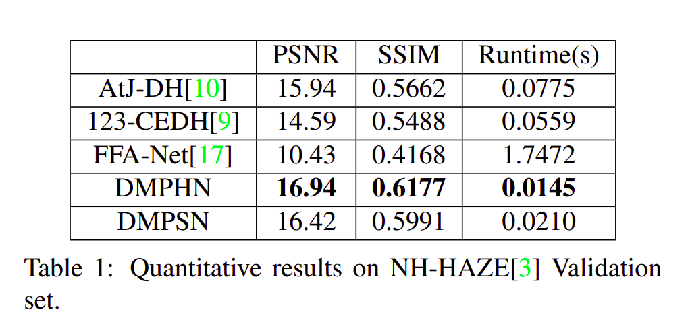

# Fast Deep Multi-patch Hierarchical Network for Nonhomogeneous Image Dehazing
The code for implementing the "Fast Deep Multi-patch Hierarchical Network for Nonhomogeneous Image Dehazing" (Accepted at NTIRE Workshop, CVPR 2020).

Preprint: https://arxiv.org/abs/2005.05999

## Highlights

- **Lightweight:** The proposed system is very lightweight as the total size of the model is around 21.7 MB.
- **Robust:**  it is quite robust for different environments with various density of the haze or fog in the scene.
- **Fast:** it can process an HD image in 0.0145 seconds on average and can dehaze images from a video sequence in real-time.

## Getting Started

For training, image paths for train, val and test data should be listed in text file (example. for image patch level traning, coresponding hazed and ground truth image paths are listed in text file with path  `./new_dataset/train_patch_gt.txt`). Pretrained models are given in the `checkpoints2/DMSHN_1_2_4` and `checkpoints/DMPHN_1_2_4`path for demo.

### Prerequisites

- Pytorch
- Scikit-image 
- Numpy
- Scipy
- OpenCV


## Running the tests

For model Inference, run following commands
```
# for Deep Multi-Patch Hierarchical Network
python DMPHN_test.py

# for Deep Multi-Scale Hierarchical Network
python DMSHN_test.py

```

## Running the Training

For model training, run following commands
```
# for Deep Multi-Patch Hierarchical Network
python DMPHN_train.py

# for Deep Multi-Scale Hierarchical Network
python DMSHN_train.py

```

# Quantitative Results


# Qualitative Results


## License

This project is licensed under the MIT License - see the [LICENSE.md](LICENSE) file for details

## Citation

Please consider citing our paper in your publications if the project helps your research. BibTeX reference is as follows.
```
@InProceedings{ Das_fast_deep_2020,
author = {Sourya Dipta Das and Saikat Dutta},
title = {Fast Deep Multi-patch Hierarchical Network for Nonhomogeneous Image Dehazing},
booktitle = {The IEEE Conference on Computer Vision and Pattern Recognition (CVPR) Workshops},
month = {June},
year = {2020}
}

```


